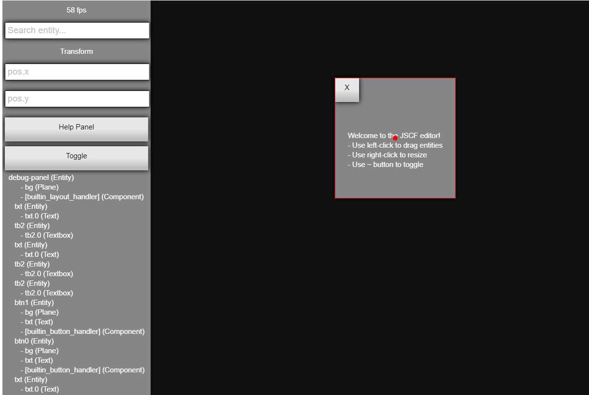
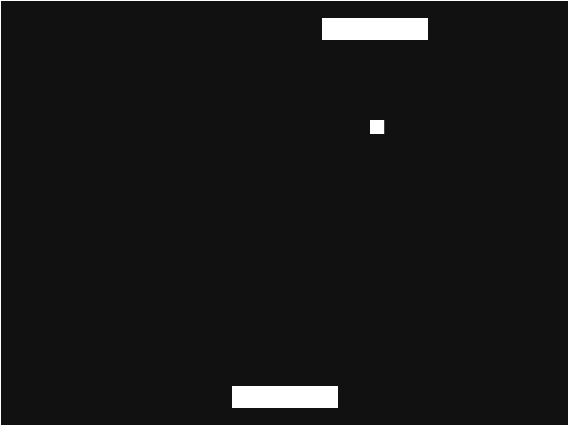

# JSCF

**JavaScript Canvas Framework.**

This is a framework and engine for canvas and javascript **based on pure JS & CanvasInput only**.
The approach is to allow extendibility while adhering to concepts from popular
engines like *Unity*. It's open source and free now and forever.

JSCF tries to be as independent library as possible and as cross-platform & as backwards-compatible as possible, so that it can be incorporated in different contexts.

## Gettting JSCF
JSCF is in development. Only prototype version is available. You can get a prototype build from [release/jscf.js](release/jscf.js), and editor from the `editor` directory.

jscf.js is a *minified* version. see the wiki for non-compact code hacking.

## Help up!

**JSCF isn't finished** -- it's still young and you can help shape it. You can start by reading CONTRIBUTING.md and looking for open issues.

**Share your JSCF projects** - let me know about your experience in JSCF projects, i'll be happy to support and be supported.

## Screenshots
**Editor:**

**Pong Demo:**

## Examples
For online editor, demos, links and more try the JSCF [website](https://g--o.github.io/web-JSCF/).

## Features
#### User end
- Editor & Meta-Editor
- External code editor HUD (with autocomplete etc.)
- GUI Widgets
- Themes

#### Management
- Components System
- Input management
- Entities & simple hirarchy
- Scripting (with pure JS)
- Asset manager
- Scene manager
- Colliders

#### Graphics
- Sprite renderer
- Animator
- Basic rects renderer

#### Miscellaneous
- Simple Physics Engine
- Docs
- Demos

## Documentation

The latest docs are always in the doc folder, but you can check our [wiki](https://github.com/g--o/JSCF/wiki), it also points to online API docs (they might should refer to latest stable version).

## License
Published under Apache 2.0

This software includes custom version of *CanvasInput.js*.
