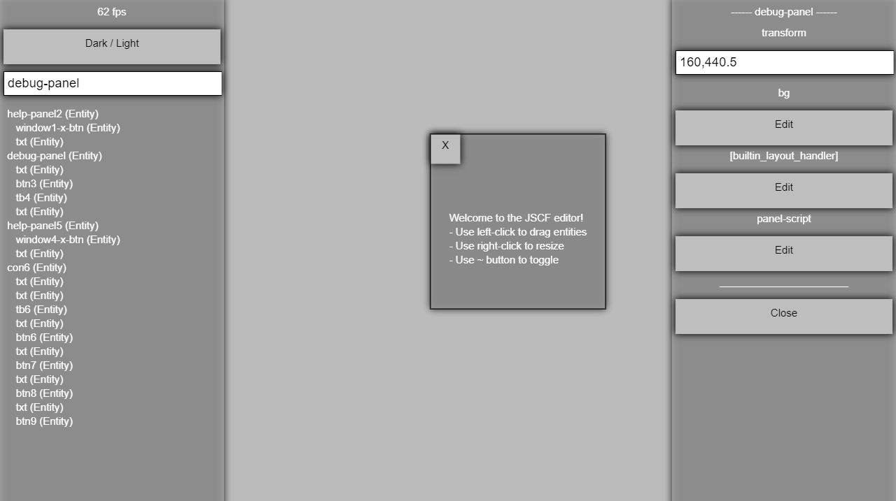

# JSCF

**JavaScript Canvas Framework.**

This is a game & ui library **based on vanilla JS & CanvasInput only!**
The approach is to allow extendibility while adhering to concepts from popular
engines like *Unity*. It's open source and free now and forever.

Another goal is to keep JSCF as independent library as possible and as cross-platform & backwards-compatible as possible.

Lastly, JSCF should be desktop AND mobile targeted, while keeping good performance.

## Gettting JSCF
JSCF is in development. Only prototype version is available. You can get a prototype build from [release/jscf.js](release/jscf.js).

jscf.js is a *minified* version. To work with non-compact code you need to manually include the core modules + needed modules & components. This helps loading only whatever is neccessary and helps us debug problems.

## Screenshots
**Pong Demo:**

**Debug Panel:**

**Debug Panel Light Theme:**

## Examples
For now you can look at the tests directory for examples. Later in development online demos will be available.

## Features
#### User end
- Editor & Meta-Editor
- GUI Widgets
- Themes

#### Graphics
- Basic rects renderer
- Sprite renderer
- Animator

#### Management
- Components System
- Input management
- Entities & simple hirarchy
- Scripts (vanilla JS)
- Asset manager
- Scene manager
- Colliders

#### Miscellaneous
- Simple Physics Engine
- Docs
- Demos

## Documentation

The latest docs are always in the doc folder, but you can check our [wiki](https://github.com/g--o/JSCF/wiki), it also points to online API docs (they might should refer to latest stable version).

## Help up!

**JSCF needs your help!** There's a work to be done and a lot of refinement, please consider contributing. You can start by reading CONTRIBUTING.md. There's a great need for help for *the world editor* and *bug fixing*.

**Share your JSCF projects!** - let us know about your JSCF projects, we'll be happy to support and be supported.

## License
Published under Apache 2.0

This software includes custom version of *CanvasInput.js*.
