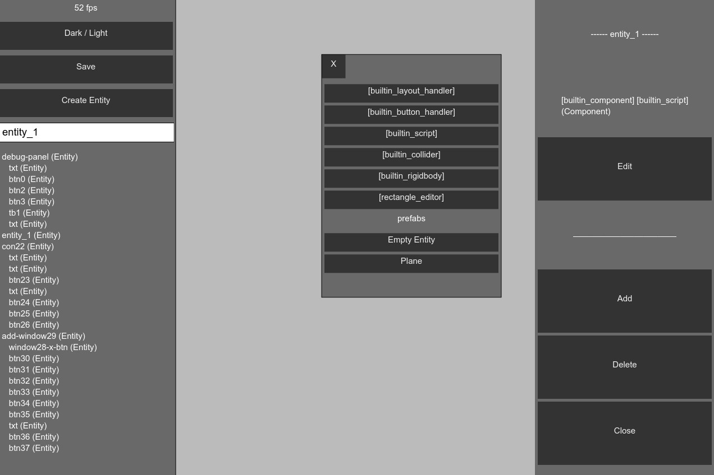

# JSCF

**JavaScript Canvas Framework.**

This is a game & ui library **based on vanilla JS & CanvasInput only!**
The approach is to allow extendibility while adhering to concepts from popular
engines like *Unity*. It's open source and free now and forever.

Another goal is to keep JSCF as independent library as possible and as cross-platform & backwards-compatible as possible.

Lastly, JSCF should be desktop AND mobile targeted, while keeping good performance.

## Gettting JSCF
JSCF is in development. Only prototype version is available. You can get a prototype build from [release/jscf.js](release/jscf.js).

jscf.js is a *minified* version. To work with non-compact code you need to manually include the core modules + needed modules & components. This helps loading only whatever is neccessary and helps us debug problems.

## Screenshots
**Pong Demo:**

**Debug Panel:**

## Features
- 2D graphical engine
- Basic rects renderer
- Sprite renderer
- Animator
- Entities & simple hirarchy
- Entity scripts
- Asset manager
- Scene manager
- Simple components System
- Colliders
- Input management (including basic UI)
- Prototype Physics Engine
- Debug Panel (prototype)
- Demos

## Documentation

Documentation is currently in progress but the source code is clear enough so that one can find whatever he seeks quickly and see the relevant API.

## Help up!

**JSCF needs your help!** There's a work to be done and a lot of refinement, please consider contributing. You can start by reading CONTRIBUTING.md. There's a great need in *documentation* and *tutorials*.

**Share your JSCF projects!** - let us know about your JSCF projects, we'll be happy to support and be supported.

## License
Published under Apache 2.0

This software includes custom version of *CanvasInput.js*.
